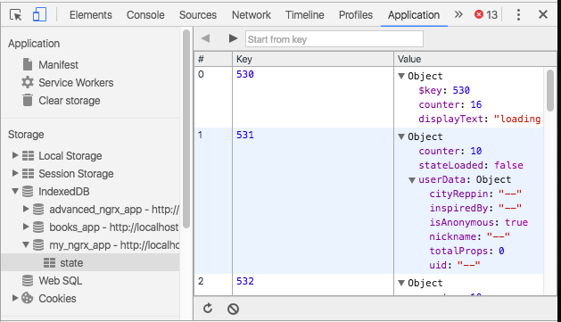

# @ngrx/db
[](https://gitter.im/ngrx/db?utm_source=badge&utm_medium=badge&utm_campaign=pr-badge&utm_content=badge)
[](https://circleci.com/gh/ngrx/db)
[](https://badge.fury.io/js/%40ngrx%2Fdb)

### The RxJS Powered Local Storage Solution for Angular2 apps

Most browsers have a local data storage mechanism called IndexedDB that allows your application to persist data after the browser is closed or refreshed. ngrx/db is a library that provides a convenient API for storing and retrieving this data, and it fits nicely into ngrx's reactive redux paradigm.

Just to make it totally clear, **ngrx/db is a local data storing mechanism for preserving the ngrx store after the page is reload or closed.** Please do not think this library has something to do with regular databases that are hosted on a server and live outside of your frontend code. ngrx/db is solely for the local indexedDB data store built into browsers. The purpose of ngrx/db is similar to *localstorage*, *cookies*, or *sessions* in the browser itself, and it just happens that the curent implementation of this feature in browsers right now is called "IndexedDB".

 


### Installation

1) Download the library from npm.

```
npm install @ngrx/db --save
```

2) Initialize ngrx/db with your schema in NgModule

Add *DBModule.provideDB()* to the *imports* array of @NgModule metatada, passing in a schema, which is a config object for indexedDB.

```
@NgModule({
  declarations: [
    AppComponent,
    OtherComponent,
  ],
  imports: [
    StoreModule.provideStore({mainState: mainStoreReducer}),
    EffectsModule.run(MainEffects),
    DBModule.provideDB(mySchema),
  ],
  providers: [
    SomeRandomService,
  ],
  bootstrap: [AppComponent,
  ]
})
export class AppModule { }
```

3) Create the schema object passed into the provideDB method.

Here is an example schema object:

```
export const mySchema: DBSchema = {
  version: 1,
  name: 'my_ngrx_app',
  stores: {
    state: initialState
  }
};
```

Where "initialState" is the same object you are using when you create a normal ngrx reducer:

```
export const mainStoreReducer: ActionReducer<MainState> =
  (state = initialState, action: Action) => {

  }
```


### Using ngrx/db In ngrx/effects
If you are following best practices for ngrx then you should be using ngrx/effects for *[side effects](https://en.wikipedia.org/wiki/Side_effect_(computer_science)).* Since accessing the indexedDB storage machanism in the browser is in a way "reaching out to the outside world" it makes sense to put operations on the indexedDB in ngrx Effects. The code snippets below are examples of @Effects that retrieve and save data from indexedDB whith the ngrx/db Database object.


### Injecting Database Object

The ngrx/db provides a *Database* object for you to inject in the constructor:

```
@Injectable()
export class MainEffects {
  constructor(private actions$:Actions, private db:Database) {
```

### Example of Pulling State Data From Local IndexedDB Data

```
@Effect()
  loadStateFromLocalStorage$:Observable<Action> = this.actions$
    .ofType(
      mainActions.ActionTypes.PULL_INITIAL_STATE_FROM_LOCAL_DB_BEGIN)
      .switchMap(() => {
        return Observable.fromPromise(this.db.query('state').toPromise())
        .flatMap((state:any) => {
          return Observable.of({type: mainActions.ActionTypes.PULL_INITIAL_STATE_FROM_LOCAL_DB_SUCCESS, payload: state})
        })
        .catch(error => Observable.of({type: mainActions.ActionTypes.PULL_INITIAL_STATE_FROM_LOCAL_DB_FAIL}))
      });
```

### Example of Saving State To Local IndexedDB Data`
```
@Effect()
  loadStateFromLocalStorage$:Observable<Action> = this.actions$
    .ofType(
      mainActions.ActionTypes.PULL_INITIAL_STATE_FROM_LOCAL_DB_BEGIN)
      .switchMap(() => {
        return Observable.fromPromise(this.db.query('state').toPromise())
        .flatMap((state:any) => {
          return Observable.of({type: mainActions.ActionTypes.PULL_INITIAL_STATE_FROM_LOCAL_DB_SUCCESS, payload: state})
        })
        .catch(error => Observable.of({type: mainActions.ActionTypes.PULL_INITIAL_STATE_FROM_LOCAL_DB_FAIL}))
      });
```


### Available Methods

Here are some other methods available on the db object:

* open(dbName: string, version?: number, upgradeHandler?: DBUpgradeHandler): Observable<IDBDatabase>;
* deleteDatabase(dbName: string): Observable<any>;
* insert(storeName: string, records: any[], notify?: boolean): Observable<any>;
* get(storeName: string, key: any): Observable<any>;
* query(storeName: string, predicate?: (rec: any) => boolean): Observable<any>;
* executeWrite(storeName: string, actionType: string, records: any[]): Observable<any>;
* compare(a: any, b: any): number;


### Debugging With Google Chrome

The dev tools in the Google Chrome browsers provide a very convenient way of validating that your data is really being saved, changed, etc. to the browser's indexedDB.




## Example Projects That Use ngrx/db

* https://github.com/xlozinguez/angular-nyc-advanced-ngrx


### TODO

Link to more example projects that use ngrx/db.

